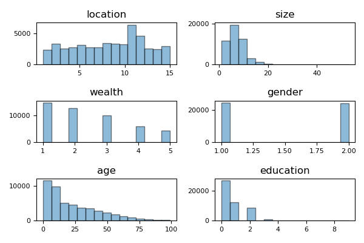
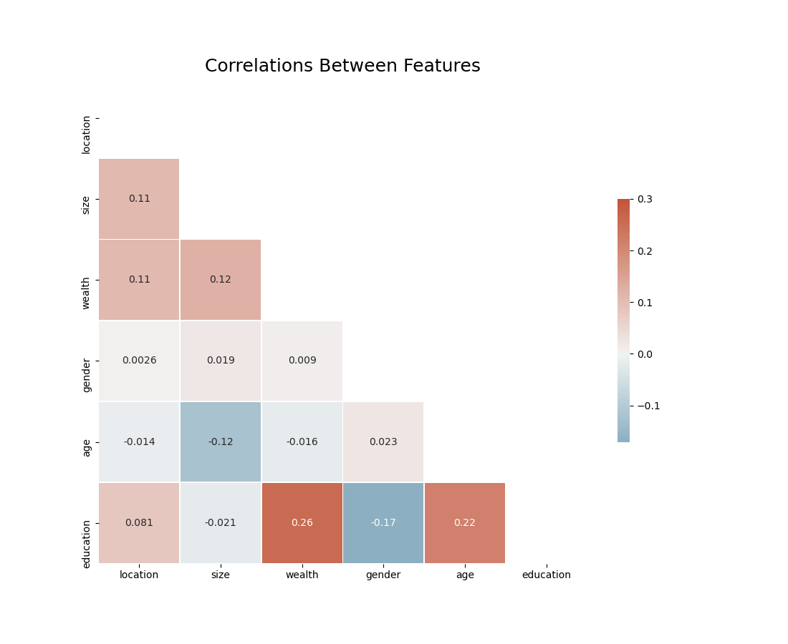
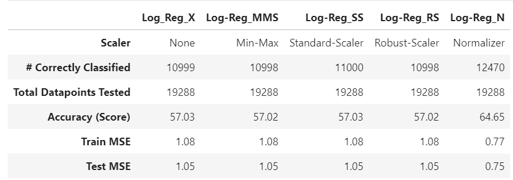
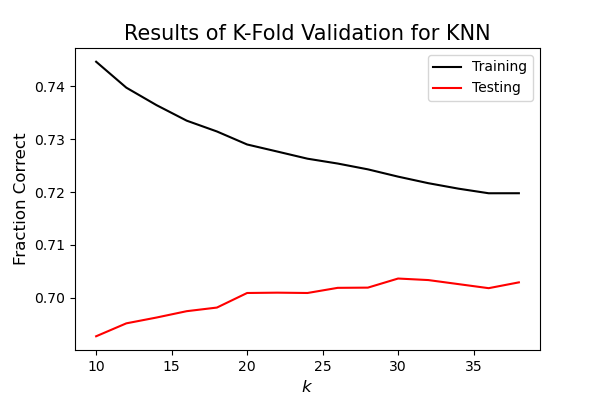
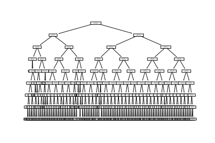
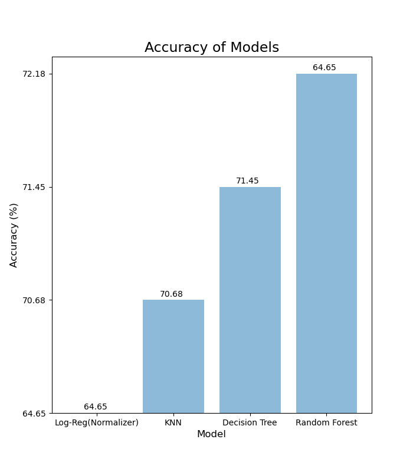

# Data 146 Extra Credit Investigation
Lydia Troup

## Introduction
  The data used on this report consists of 48219 data points on location, size, wealth, gender, age and education of individuals in Liberia. Each data point corresponds to a different individual, with wealth and education represented with digits, where higher values indicate higher levels of education and wealth, and lower values indicate lower levels of education and wealth. The mean value for education is 0.67, indicating that the average level of education of those surveyed is low. Something of note for education; the only values are 0, 1, 2, 3, 8, 9, skipping 4-7. The graphs below illustrate the distribution of data points for each of the features, along with education, the factor we are trying to predict. The graphs below show the data consists of mostly young individuals with lower levels of education and wealth and the gender split appears to be very even. 

  
  The correlation matrix below was created to show the importance of integrating all the features into a multidimensional model to predict education values. None of the variables are strongly correlated with education; wealth has the highest correlation of just 0.26. Because of the weak linear relationships between individual variables, a multidimensional model will perform the best for predicting education values. 

  The models tested in this report use location, size, wealth, gender, and age as features to predict the target value: education. Classification models were used to classify individual data points into six groups of education (integers 0 through 6). Logistic regression models were created and tested using a variety of scalers to standardize the features of the data. Additionally, a K-Nearest-Neighbors (KNN) model was trained and tested, as well as decision tree and random forest models. Of these models, the random forest model performed the best, with a testing score of 0.7218, with the decision tree model fell close behind with a testing score of 0.7145. The KNN model performed decently as well, with an accuracy of 70.68%. The logistic regression models performed much worse with most testing scores falling around 50-60%, meaning the models only correctly predicted education levels about half the time.

  Prior to standardizing the data, a train-test split was performed, randomly assigning 40% of the data points to a testing group, and 60% to a training group. A random state of 146 was utilized to ensure reproducability. 

## Logistic Regression Models
  Four different scalers were tested to standardize the data prior to the logistic regression. Of the four, the logistic regression using the normalizer scaler performed the best with an accuracy of 64.65%, meaning the model correctly predicted education for 64.65% of the testing data points. Normalizer transforms all features in a row to values between -1 and 1, and does so for all data points in a dataset. This scaler produced the lowest testing mean squared error as well (0.75). Of the 19,288 data points tested, the normalizer scaler correctly classified 12,470 data points. Interestingly, the regressions utilizing the min-max-scaler and robust scaler both performed the same, each with an accuracy of 57.03%.

  The chart below shows the accuracy, number of correctly classified points, and training and testing mean squared errors for the logistic regressions using each of the different scalers.

## K Nearest Neighbors Model
A K nearest neighbors model was performed using this training testing set as well. A k nearest neighbors model looks at k nearest points to predict what group a point belongs in. A k-fold validation was performed on the data to identify an ideal k value for the model. The graph below shows the results from that test. The graph below shows the average testing and training scores for all k values tested in the k-fold validation. A k value of 30 was chosen for the model, as that’s where the testing score peaks and the model becomes less overfit (difference between training and testing is less).

  After determining the best k value, knn models with k values of 30 were tested for each of the scalers used on the logistic regression. Out of the scalers tested, the min-max scaler performed the best. The min-max scaler transforms the features of the data to the range 0 to 1, so that each feature has a value in the range of 0 to 1 for all data points. Use of this scaler produced a knn model with a score of 0.7068, meaning the model predicted the correct value for education 70.68% of the time in the testing data. This model performed much better than any of the logistic regressions, with a nearly 20% increase in accuracy.

## Decision Tree Model
A grid search was performed to identify the values for minimum samples to split and maximum depth that yield the highest testing score for the model. Integers 2 to 19 were tested for both parameters. A maximum depth of 8 combined with a value of 9 for the minimum samples needed to split a node produced the highest testing score, 0.7145. Additionally, the model was not overfit, the training score was only approximately 0.0186 higher than the testing score. This means the model performs similarly on both data it has seen before and data it has not.
	
  In the tree produced using a random state of 146, the initial split is based on the age of the individual, specifically whether or not it is greater than or less than/equal to 9.5. The model continues to make splits based on the attributes of the data and continues to a depth of 8, resulting in a very complex tree. The image below shows the tree for comprehension purposes, although it is too complex of a tree to read any of the information on the splits.

## Random Forest Model
Ideally, a grid search would be performed to identify the best combination of number of trees, maximum depth, and minimum samples to split, however this proved to be too computationally intensive for the laptop in use, and failed to complete. Instead, the maximum depth and minimum samples to split from the decision tree model were used, 8 and 9 respectively. 
	
  A k fold validation was performed to determine the optimal number of trees in the random forest model. The numbers 3000, 3250, and 3500 were tested, as the model score was found to be lower at 4000 trees than 3000 trees using the random state 146. The k fold validation determined 3500 trees was the ideal number of trees out of those tested. 

  A random forest model with a maximum depth of 8, minimum samples to split of 9, 3500 trees, and a random state of 146 yielded a score of 0.7218. Interestingly, a random forest model with 3000 trees and the other parameters above the same produced a slightly higher score. Despite this, 3500 trees is still ideal as the k fold result gives a more accurate result. The k fold validation had a k value of 2, meaning it tested the models with two separate sets of training and testing data, producing a more accurate result. 

## Conclusion
Of the models tested the random forest model with 3500 trees, a maximum depth of 8 and 9 minimum samples was the best performing model. It had an accuracy of 72.18% on the testing data. Theoretically, if this sample is representative of the population, this model could accurately predict an individual’s education based on their age, location, wealth, gender, and size in Libera 72% of the time.
	The graph below compares the accuracy of the best logistic, KNN, decision tree, and random forest models. From the graph it is clear that, for this dataset, as the model becomes more complex it's accuracy increases.

